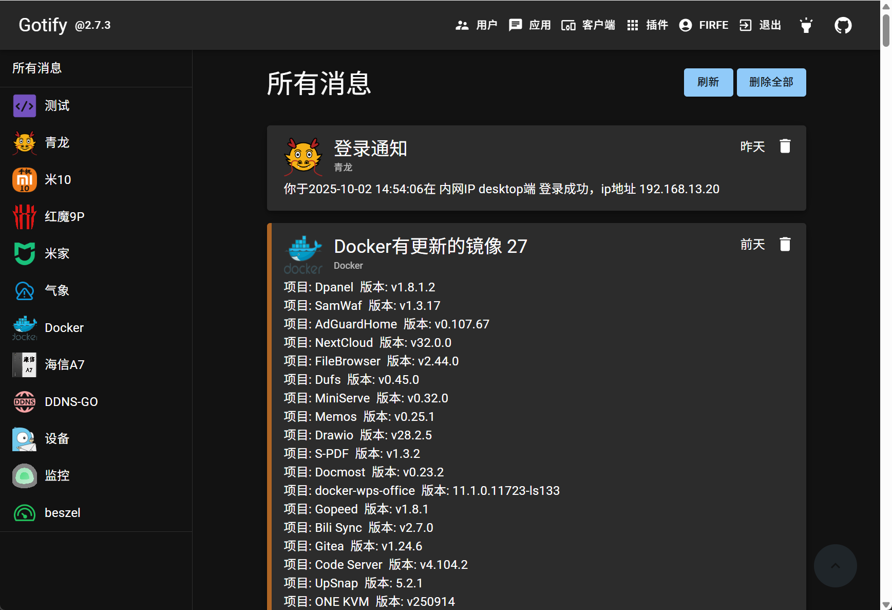

<p align="center">
  
</p>

# gotify 服务端

- 原项目地址
  - 官网 https://gotify.net/
  - GitHub仓库 https://github.com/gotify/server
- 我汉化和构建docker镜像的仓库
  - GitHub仓库 https://github.com/Firfr/gotify_zh
  - Gitee仓库 https://gitee.com/firfe/gotify_zh

## 汉化&修改&镜像制作

如果镜像拉取失败，请B站发私信，或提issues，  
华为云上的镜像仓库默认推送的镜像不是公开的，有可能是我忘记设置公开了。

当前制作镜像版本(或截止更新日期)：3.0.0 2026年08月27日

首先感谢原作者的开源。  
原项目没有中文，我就行了汉化，制作了中文docker镜像。

具体汉化了那些内容，请参考[翻译说明](./翻译说明.md)。

只做了汉化和简单修改，有问题，请到原作者仓库处反馈。

欢迎关注我B站账号 [秦曱凧](https://space.bilibili.com/17547201) (读作 qín yuē zhēng)  

有需要帮忙部署这个项目的朋友,一杯奶茶,即可程远程帮你部署，需要可联系。  
微信号 `E-0_0-`  
闲鱼搜索用户 `明月人间`  
或者邮箱 `firfe163@163.com`  
如果这个项目有帮到你。欢迎start。

### 镜像

从阿里云或华为云镜像仓库拉取镜像，注意填写镜像标签，镜像仓库中没有`latest`标签

容器内部端口`80`，可通过设置环境变量`GOTIFY_SERVER_PORT`的值来指定监听端口。

- AMD64镜像 (这个我已经在使用了)
  ```bash
  swr.cn-north-4.myhuaweicloud.com/firfe/gotify:3.0.0
  ```
- ARM64镜像 (这个镜像没设备测试可能会有问题)
  ```bash
  swr.cn-north-4.myhuaweicloud.com/firfe/gotify:3.0.0-arm64
  ```

下面部署的时候，注意把汉字好成实际对应的内容。

### docker run 命令部署

```bash
docker run -d \
--name gotify \
--network bridge \
--restart always \
--log-opt max-size=1m \
--log-opt max-file=1 \
-e GOTIFY_DEFAULTUSER_NAME=用户名 \
-e GOTIFY_DEFAULTUSER_PASS=密码 \
-p 端口:80 \
-v 数据目录:/app/data \
swr.cn-north-4.myhuaweicloud.com/firfe/gotify:3.0.0
```

### compose 文件部署 👍推荐

```yaml
#version: '3'
name: gotify
services:
  gotify:
    container_name: gotify
    image: swr.cn-north-4.myhuaweicloud.com/firfe/gotify:3.0.0
    network_mode: bridge
    restart: always
    logging:
      options:
        max-size: 1m
        max-file: '1'
    environment:
      GOTIFY_DEFAULTUSER_NAME: 用户名
      GOTIFY_DEFAULTUSER_PASS: 密码
    ports:
      - 端口:80
    volumes:
      - ./data:/app/data
```

### 效果截图


